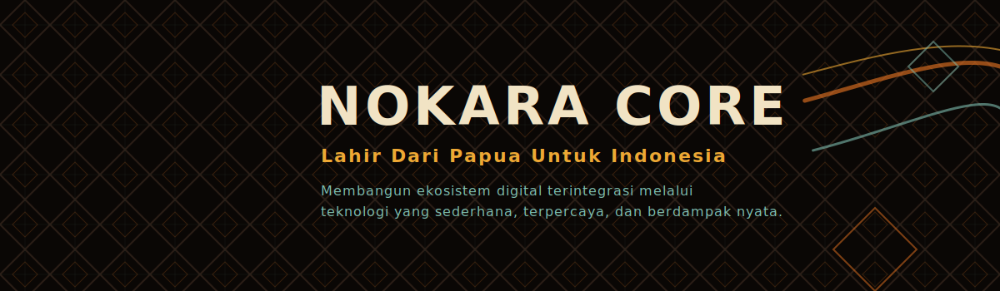
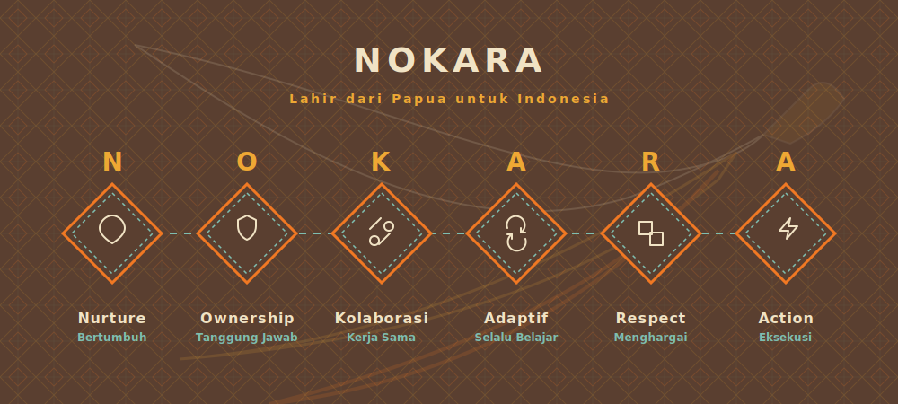

<div align="center">

<!-- Banner Atas -->


<br/>
<br/>

# NOKARA CORE

**Membangun Ekosistem Digital Terintegrasi yang Memberdayakan Masyarakat Indonesia.**

<!-- Tombol Navigasi -->
[](https://nokara.id)
[](#proyek-unggulan)
[](#bergabung-dengan-kami)

<br/>

<!-- Animasi Identitas Brand -->


</div>

<br/>

## Filosofi & Janji Kami

> **NOKARA** bukan sekadar entitas teknologi. Ini adalah simbol pertumbuhan, kolaborasi, dan kemajuan digital yang **lahir dari Papua untuk Indonesia**.

Kami berkomitmen untuk membangun ekosistem perangkat lunak yang mengatasi keterbatasan akses. Fokus utama kami adalah menciptakan teknologi yang memenuhi 4 pilar berikut:

| Dekat dengan Masyarakat | Sederhana | Terpercaya | Mudah Diakses |
| :--- | :--- | :--- | :--- |
| Memahami dan hadir untuk memecahkan masalah lokal secara nyata. | Desain antarmuka yang intuitif dan ramah pengguna untuk semua kalangan. | Keamanan data dan keandalan sistem yang selalu dijaga. | Integrasi mulus dengan platform keseharian user. |

<br/>

---

## Budaya Perusahaan (Pipeline Pertumbuhan)

Budaya kami bergerak secara linier. Kami memastikan setiap baris kode yang ditulis berujung pada manfaat nyata bagi pertumbuhan masyarakat, UMKM, dan institusi pendidikan.

<div align="center">

```mermaid
graph LR
    A["BUILD<br/>Membangun Fondasi"] --> B("GROW<br/>Skalabilitas Solusi")
    B --> C("IMPACT<br/>Dampak Nyata")
    style A fill:#5A3F30,stroke:#F07823,stroke-width:2px,color:#F1E3C4
    style B fill:#7EBEB0,stroke:#5A3F30,stroke-width:2px,color:#111
    style C fill:#EEA834,stroke:#5A3F30,stroke-width:2px,color:#111
